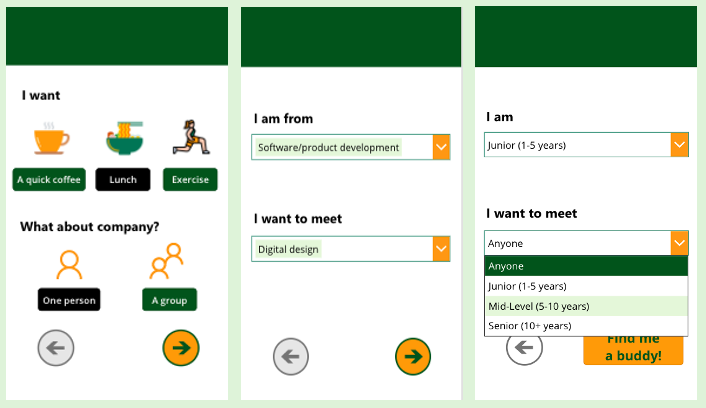
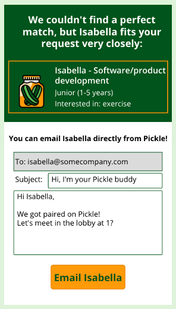

# Pickle Power App

  

## About
Pickle is a lunchtime buddy finder/casual networking Power App for those who work in large organisations and what to meet new people from different departments or are simply looking for a lunchtime jog buddy. Finding a buddy is a 3-step process: you choose what you want a buddy for (quick coffee, lunch or exercise), specify your business unit and a business unit you want to meet people from and also your level of seniority (in years) and desired seniority. If you're not fussed about BU and seniority, you can select "Anyone" for these options. The option to match with multiple people is currently under development.

  

## Matching and messaging
When finding a buddy, the perfect matching is desired but is not always possible. Partial matching is enabled by prioritising user preferences:
* Choice of activity and Seniority are prioritised first - they have to match perfectly (i.e. the user's seniority has to be another user's desired seniority for the pairing to occur at all)
* Business unit is prioritised next
* Number of buddies is prioritised last

That is, if there is no perfect match, the algorithm looks for matches without considering the desired number of buddies. If there is still no match, it tries without business unit preferences. If there is no match at all, the user can request for their details to be saved to the database for future matching (replacing any existing records of that user) or to tweak their preferences. When a match is found, the algorithm returns the first matching record, meaning that those who have been waiting for longer get matched first.

Once matched, Pickle utilises Power Automate to enable the users to email their buddies straight from the app. Note that the email will come from my personal account due to Power Automate requirements - in practice the app would be linked to a Pickle inbox.

  

## Investigating target users and problem context with PACT analysis
To study the context of the proposed app and try to understand target users, it is best to use a structured framework like PACT (see [here](http://hci.ilikecake.ie/requirements/pact.htm) for details). PACT framework suggests the app is discussed in the context of **P**eople (target users), relevant **A**ctivities those people undertake, **C**ontext of such activities and **T**echnologies used. I omitted the full analysis to keep this brief but the guiding questions I tried to answer include:

* Who are the users? (Demographics, employment etc.)
* What is their level of tech proficiency?
* What motivates, pleases and engages the users, in particular with the current apps they use?
* Are we looking at frequent or infrequent users?
* What are the users' goals, tasks and actions?
* How are they currently performing those tasks? On what devices?
* Are these activities memorable? Are they done often?
* What is the social and organisational context of these tasks? How are similar tasks handled in the workplace - this is particularly important to discuss for a social app.

## Target persona
Ideally, the process of creating a persona would involve the target users themselves, for example through surveys and user stories. At this stage, this is not possible but any further development should definitely involve a more user-centric approach.

Based on PACT analysis, our target persona looks something like this:

<table>
  <tr>
    <th>Persona </th>
    <th>Description</th>
  </tr>
  <tr>
    <td></td>
    <td>James, 25, is a junior marketing specialist at a large tech company in Sydney. He has been at this company for three years, ever since he graduated.  James is tech-savvy and spends a lot of time on his phone. He checks Facebook, Instagram and LinkedIn daily on his smartphone on the way to work, during the day when he gets bored and in the evening. From time to time, he uses dating apps; he's tried both Tinder and Bumble. Internally, he uses Teams and Yammer, mainly to discuss work and contact people he doesn't know personally to ask specialist questions. He likes the simplicity of these interfaces and finds it easy to remember what to do when he hasn't used them in a long time (especially with the occasional use apps). James socialises with his colleagues regularly, usually by grabbing a coffee after the morning standup and occasionally over lunch. He likes to chat to his immediate teammates during the day and always attends lunch-and-learns when he has the time.</td>
  </tr>
  <tr>
    <td colspan="2"><b>James's problem</b>: James likes meeting new people but has not had the opportunity to engage socially with people outside of his business unit. Though he is a social person and the company culture is friendly and welcoming, James finds himself unable to approach colleagues he does not know well because he does not want to bother busy people or senior colleagues. He expects that a lot of people at the company feel the same way. He knows most people in his business unit and occasionally grabs lunch with members of his team. However, more often than not he finds himself having solitary lunches, often due to everyone's different schedules and he wishes there was an easy way to meet someone outside his immediate business unit just for a chat.</td>
  </tr>
  <tr>
    <th width="50%">James's problem </th>
    <th>App functionality to address it</th>
  </tr>
  <tr>
    <td>James doesn't have a way of approaching someone he doesn't know at work and asking them to get lunch - some people might find it strange.</td><td>Pickle will pair James with another person or a group of people who are also looking for company. The group pairing feature is still under development.</td>
  </tr>
  <tr>
    <td>James would love to have more opportunities to talk to senior people about advancing his career.</td><td>Pickle has options to specify your level of seniority (in years of work) and, similarly, to select who you would like to meet.</td>
  </tr>
  <tr>
    <td>James loves learning from others and wishes there was a way to casually meet up with different specialists across the organisation, be that to ask some specific questions or just see what the work is like in the rest of the organisation.</td><td>Pickle lets you specify your business unit and select a particular business unit you are looking to meet people from.</td>
  </tr>
  <tr>
    <td>James goes for lunchtime jogs or gym classes from time to time and would like to have a lunchtime exercise buddy, but he doesn't know anyone interested.</td><td>Pickle isn't limited to finding food buddies - you can specify that you are looking for someone to join you for exercise.</td>
  </tr>
</table>

## Data sources
There are two dynamic data sources in the app, stored as Excel workbooks in OneDrive. The first, **Business Ares**, is a list of business areas of the company - it can be easily changed by a participating company to reflect the organisational structure. The second dataset, **Participants**, contains the details of users: choice of activity (quick coffee break, lunch or exercise), choice of how many buddies they want, their business unit and the business unit they would like to meet people from, their seniority (in years of work) and the seniority of people they would like to meet. When a new user enters their preferences, these are matched against the records in the database. 

To enable the complex data manipulations and allow the users to change their preferences before writing to the database, the app utilises a number of Collections.

## App extensibility
### Scalability
The most important aspect of ensuring that the app can support a growing number of users is switching to a more robust data storage method, e.g. an Azure SQL database. SQL data manipulation is much faster than in Excel and the speed will become crucial with an increasing number of records that have to be matched and more complex matching needs. Having a fully managed cloud database also enables scaling on-demand.

The matching process itself is the most computationally-heavy part. At the moment, the matching is basic and is done in O(m\*n) time, where m is the number of features to match on and n is the number of users. A more efficient data structure and matching process will be needed to fully implement multi-person and multi-business-unit matching and maintain a reasonable speed and UX as the number of users and matching features grows. That said, the matching should be kept simple to avoid excessive personalisation and dating-like experience, as the primary function of the app is to pair people in a professional context to do things at lunchtime.

Pickle is currently a business version of the broader app I am planning to make. On the larger scale, Pickle will enable anyone to look for lunchtime buddies. This means that the business unit and seniority preferences will be replaced with something more general, like industry/professional interest, age bracket, location and preferred places to eat. Neither version of the app will involve user photos or a lot of personal details, as the app is not intended for dating purposes.

### Future feature improvements
Some of the features that will be implemented in future iterations include: 
* An in-chat messenger feature instead of emailing - this is entirely possible in Power Apps. The user should also receive a push notification when the match occurs.
* A lunchtime window - the app should only function between 12pm-2pm to make it more lunchtime-specific and exciting for the users.
* To make it more interesting, the user could specify a particular cuisine that they want. A map API would allow them to browse nearby places and suggest these to their match.
* More sophisticated matching; the users should be able to emphasize the most important matching conditions, e.g. instead of selecting seniorities, the user could filter out the seniorities they don't want or specify that e.g. the business unit has to match perfectly; the group matching feature is also currently under development.
* General accessibility - Pickle has accessible labels and meets WCAG Level AAA contrast requirements. In future iterations, it is important to ensure compliance with other aspects of WCAG and implement alternative colour themes for people with colourblindness.

## Acknowledgements

Icons in this app were made by <a href="https://www.flaticon.com/authors/mynamepong" title="mynamepong">mynamepong</a>, <a href="https://www.flaticon.com/authors/flat-icons" title="Flat Icons">Flat Icons</a>, <a href="https://www.flaticon.com/authors/ultimatearm" title="ultimatearm">ultimatearm</a> and <a href="https://www.flaticon.com/authors/surang" title="surang">surang</a> from <a href="https://www.flaticon.com/" title="Flaticon"> www.flaticon.com</a>

